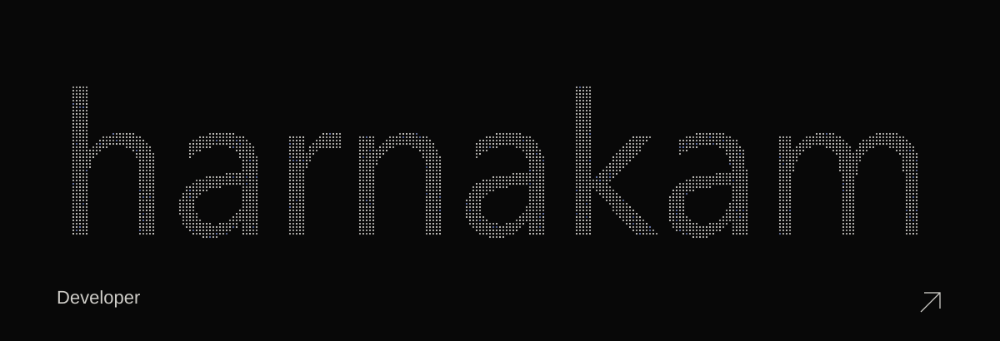

<a href="https://harnakam.com">
  <picture>
    <source media="(prefers-reduced-motion: reduce)" srcset="./assets/identity-still.svg" />
    
  </picture>
</a>

  <b>Systems &nbsp; / &nbsp; Graphics &nbsp; / &nbsp; AI</b>

  
  
  

 

## Stack

  

 

## Projects

| | |
| :--- | :--- |
| **[POW ↗](https://github.com/harnakam/POW)** Codex · Agent Skills | **[Common Core Grader ↗](https://github.com/harnakam/common-core-grader)** Go · Systems tooling |
| **[42 Norm Formatter ↗](https://marketplace.visualstudio.com/items?itemName=harnakam.42-norm-formatter)** C / Python · VS Code | **[Grader ↗](https://marketplace.visualstudio.com/items?itemName=harnakam.grader)** Code review · VS Code |
| **[Pastel Color Theme ↗](https://github.com/harnakam/pastel-color-theme)** 18 themes · Light & dark | **[harnakam.com ↗](https://harnakam.com)** Graphics · Interactive web |

 

## Activity

 

## Playground

  <a href="https://harnakam.com/#horizon"><b>Horizon ↗</b></a>
  &nbsp;&nbsp; · &nbsp;&nbsp;
  <a href="https://harnakam.com/#playground"><b>Particles ↗</b></a>
  &nbsp;&nbsp; · &nbsp;&nbsp;
  <a href="https://harnakam.com/#light"><b>Light ↗</b></a>
  &nbsp;&nbsp; · &nbsp;&nbsp;
  <a href="https://harnakam.com/#deep"><b>Space ↗</b></a>

