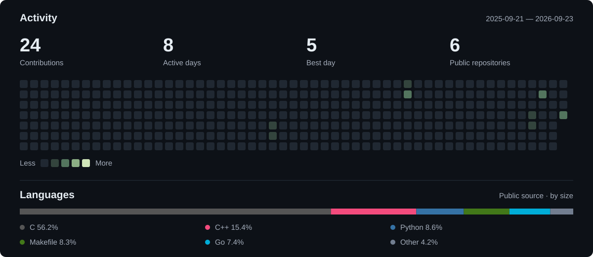

<a href="https://harnakam.com">
  <picture>
    <source media="(prefers-reduced-motion: reduce)" srcset="./assets/light-still.svg" />
    
  </picture>
</a>

  <b>Systems &nbsp; / &nbsp; Graphics &nbsp; / &nbsp; AI</b>

  
  
  

 

## Stack

  

 

## Projects

<table width="100%">
<tr>
<td width="50%"><h3><a href="https://github.com/harnakam/POW">POW ↗</a></h3>
Codex · Agent Skills
</td>
<td width="50%"><h3><a href="https://github.com/harnakam/common-core-grader">Common Core Grader ↗</a></h3>
Go · Systems tooling
</td>
</tr>
<tr>
<td><h3><a href="https://marketplace.visualstudio.com/items?itemName=harnakam.42-norm-formatter">42 Norm Formatter ↗</a></h3>
C / Python · VS Code
</td>
<td><h3><a href="https://marketplace.visualstudio.com/items?itemName=harnakam.grader">Grader ↗</a></h3>
Code review · VS Code
</td>
</tr>
<tr>
<td><h3><a href="https://github.com/harnakam/pastel-color-theme">Pastel Color Theme ↗</a></h3>
18 themes · Light &amp; dark
</td>
<td><h3><a href="https://harnakam.com">harnakam.com ↗</a></h3>
Graphics · Interactive web
</td>
</tr>
</table>

 

## Activity

<a href="https://github.com/harnakam?tab=overview">
  <picture>
    <source media="(max-width: 600px)" srcset="./assets/activity-mobile.svg" />
    
  </picture>
</a>

 

 

<picture>
  <source media="(prefers-reduced-motion: reduce) and (max-width: 600px)" srcset="./assets/activity-mobile.svg" />
  <source media="(prefers-reduced-motion: reduce)" srcset="./assets/activity.svg" />
  <source media="(prefers-color-scheme: dark)" srcset="./assets/snake-dark.svg" />
  
</picture>

## Playground

  <a href="https://harnakam.com/#horizon"><b>Horizon ↗</b></a>
  &nbsp;&nbsp; · &nbsp;&nbsp;
  <a href="https://harnakam.com/#playground"><b>Particles ↗</b></a>
  &nbsp;&nbsp; · &nbsp;&nbsp;
  <a href="https://harnakam.com/#light"><b>Light ↗</b></a>
  &nbsp;&nbsp; · &nbsp;&nbsp;
  <a href="https://harnakam.com/#deep"><b>Space ↗</b></a>

