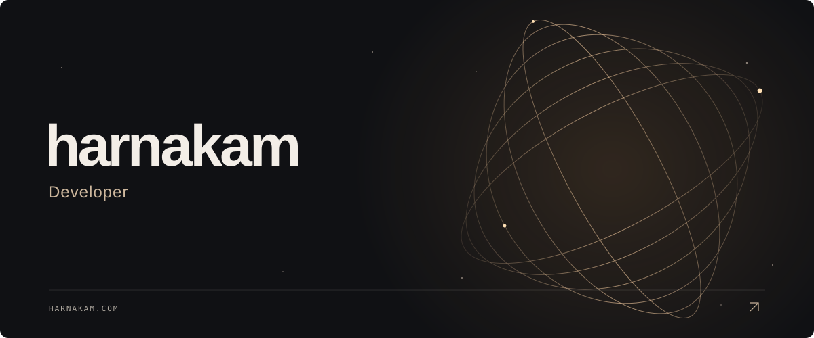

  

  <a href="https://harnakam.com">Website ↗</a>
  &nbsp; · &nbsp;
  <a href="https://github.com/harnakam?tab=repositories">Code</a>
  &nbsp; · &nbsp;
  <a href="https://marketplace.visualstudio.com/publishers/harnakam">Extensions</a>

 

  EXPLORE  
  <a href="https://harnakam.com/#horizon">◌ &nbsp; Horizon</a>
  &nbsp;&nbsp; / &nbsp;&nbsp;
  <a href="https://harnakam.com/#playground">⠿ &nbsp; Playground</a>
  &nbsp;&nbsp; / &nbsp;&nbsp;
  <a href="https://harnakam.com/#light">✧ &nbsp; Light</a>
  &nbsp;&nbsp; / &nbsp;&nbsp;
  <a href="https://harnakam.com/#deep">↗ &nbsp; Space</a>

 

Projects

 

[POW](https://github.com/harnakam/POW) · [Common Core Grader](https://github.com/harnakam/common-core-grader) · [Pastel Color Theme](https://github.com/harnakam/pastel-color-theme)

[42 Norm Formatter](https://marketplace.visualstudio.com/items?itemName=harnakam.42-norm-formatter) · [Grader](https://marketplace.visualstudio.com/items?itemName=harnakam.grader)

Still

 

